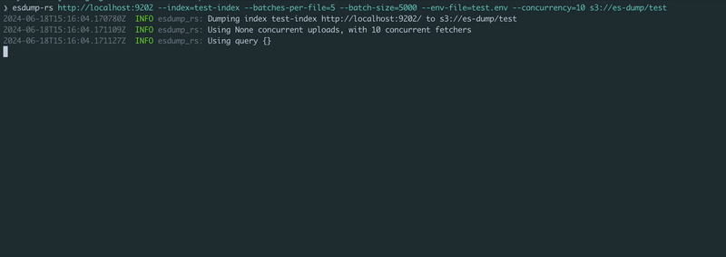

# esdump-rs

Dump Elasticsearch or OpenSearch  indexes to blob storage, really-really fast :rocket:

Features:
- Super-dooper fast
- Supports compressing output with zstd or gzip
- Natively supports blob storage on AWS, Google Cloud and Azure
- Supports filtering and selecting specific fields
- Detailed progress output and logging
- Comes as a single, small static binary or a Docker image
- Runs on Windows, Linux or MacOS
- Written in Rust :crab:



## Installation

**Releases:** Grab a pre-built executable [from the releases page](https://github.com/GitGuardian/esdump-rs/releases)

**Docker:** `docker run ghcr.io/gitguardian/esdump-rs:latest`

## Usage

Pass the Elasticsearch or OpenSearch HTTP(s) URL and a blob storage URL. Set the credentials in the environment
(see [example.env](./example.env)), and run!

```shell
$ esdump-rs http://localhost:9200 s3://es-dump/test/ \
  --index=test-index \
  --batches-per-file=5 \
  --batch-size=5000
```

Records are walked with `search_after` over `_shard_doc` inside a point-in-time, resuming each
page from the previous page's sort values. That makes the dump exact on indices holding
tombstoned documents — anything that has seen deletes or updates — at the cost of paging a
single index sequentially. Run one process per index to go wider.

Settings such as the batch size can be set as flags

```shell
Usage: esdump-rs [OPTIONS] --index <INDEX> --batch-size <BATCH_SIZE> --batches-per-file <BATCHES_PER_FILE> <ELASTICSEARCH_URL> <OUTPUT_LOCATION>

Arguments:
  <ELASTICSEARCH_URL>  Elasticsearch cluster to dump
  <OUTPUT_LOCATION>    Location to write results. Can be a file://, s3:// or gs:// URL

Options:
  -i, --index <INDEX>
          Index to dump
  -c, --concurrency <CONCURRENCY>
          Retained for compatibility and ignored; paging within an index is sequential
  -l, --limit <LIMIT>
          Limit the total number of records returned
  -b, --batch-size <BATCH_SIZE>
          Number of records in each batch
      --batches-per-file <BATCHES_PER_FILE>
          Number of batches to write per file
  -q, --query <QUERY>
          A file path containing a query to execute while dumping. Its `query` clause filters
          the dump and the record count
  -f, --field <FIELD>
          Specific fields to fetch
      --compression <COMPRESSION>
          Compress the output files [default: zstd] [possible values: gzip, zstd]
      --concurrent-uploads <CONCURRENT_UPLOADS>
          Max chunks to concurrently upload *per task*
      --upload-size <UPLOAD_SIZE>
          Size of each uploaded [default: 15MB]
  -d, --distribution <DISTRIBUTION>
          Distribution of the cluster [possible values: elasticsearch, opensearch]
      --env-file <ENV_FILE>
          Distribution of the cluster [default: .env]
  -h, --help
          Print help
  -V, --version
          Print version
```